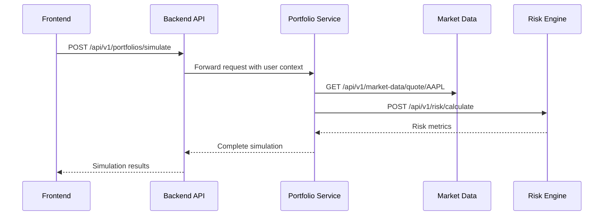

# Service Communication Patterns

## Core Service Endpoints

### 1. Backend API Service (`backend-api-service`)
- **Port**: 10000
- **Base URL**: `https://backend-api-service.onrender.com`

#### Authentication Endpoints
```http
POST /api/v1/auth/register
POST /api/v1/auth/login
POST /api/v1/auth/refresh
```

#### Portfolio Endpoints
```http
POST   /api/v1/portfolios/simulate
GET    /api/v1/portfolios/:id
DELETE /api/v1/portfolios/:id
```

### 2. Market Data Service (`market-data-ingestion-service`)
- **Port**: 10003
- **Base URL**: `https://market-data-ingestion-service.onrender.com`

#### Market Data Endpoints
```http
GET /api/v1/market-data/quote/:symbol
GET /api/v1/market-data/historical/:symbol?interval=daily&range=1mo
```

## Engine Services

### 3. AI Microservice Engine (`ai-microservice-engine`)
- **Port**: 10001
- **Base URL**: `https://ai-microservice-engine.onrender.com`

#### AI Endpoints
```http
POST /api/v1/ai/analyze-behavior
POST /api/v1/ai/generate-nudge
```

### 4. Python Risk Engine (`python-risk-engine`)
- **Port**: 10002
- **Base URL**: `https://python-risk-engine.onrender.com`

#### Risk Calculation Endpoints
```http
POST /api/v1/risk/calculate
GET  /api/v1/risk/portfolio/:portfolioId
```

## Service-to-Service Communication

### Request Flow: Portfolio Simulation



### Caching Strategy

1. **Redis Caching Layers**:
   - Market Data: `market:{symbol}:{interval}` (TTL: 1-5 minutes)
   - Risk Calculations: `risk:{portfolio_hash}` (TTL: 1 hour)
   - AI Responses: `ai:{user_id}:{context_hash}` (TTL: 24 hours)

2. **Cache Invalidation**:
   - Market data invalidated by scheduled jobs
   - Risk calculations invalidated on portfolio changes
   - AI responses invalidated after user actions

## Error Handling

### Standard Error Response Format
```json
{
  "error": {
    "code": "ERROR_CODE",
    "message": "Human-readable error message",
    "details": {}
  }
}
```

### Common Error Codes
- `400`: Bad Request
- `401`: Unauthorized
- `403`: Forbidden
- `404`: Not Found
- `429`: Rate Limited
- `500`: Internal Server Error

## Rate Limiting

| Service                 | Rate Limit          | Scope       |
|-------------------------|---------------------|-------------|
| Backend API             | 100 req/15min      | Per User    |
| Market Data Service     | 60 req/sec         | Global      |
| AI Microservice         | 20 req/min         | Per User    |
| Risk Engine             | 50 req/min         | Per Service |

## Monitoring and Observability

Each service exposes:
- `/health`: Service health status
- `/metrics`: Prometheus metrics
- `/logs`: Access logs (when enabled)

## Security

1. **Authentication**: JWT tokens issued by Firebase
2. **Authorization**: Role-based access control (RBAC)
3. **TLS**: All external communications are encrypted
4. **Input Validation**: All endpoints validate input data

## Deployment Notes

1. **Environment Variables**:
   - Required variables are documented in each service's README
   - Sensitive values are managed through Render's secrets

2. **Scaling**:
   - Stateless services can be scaled horizontally
   - Redis is used for distributed locking when needed
   - Database connection pooling is configured for optimal performance
