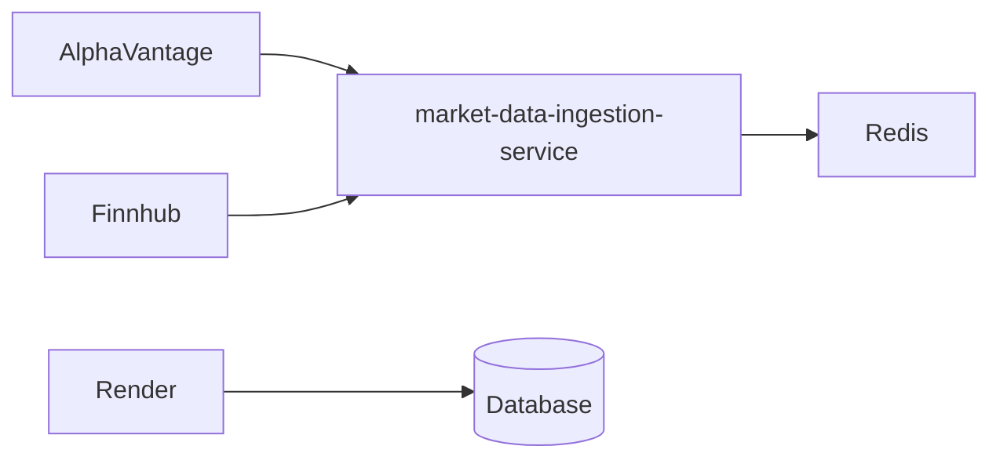
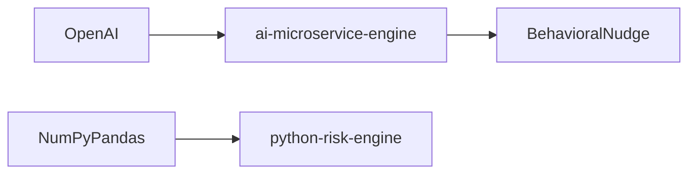
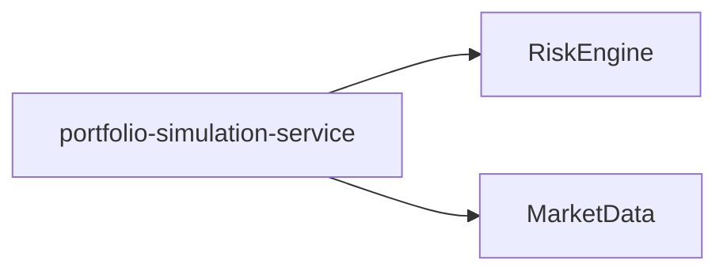
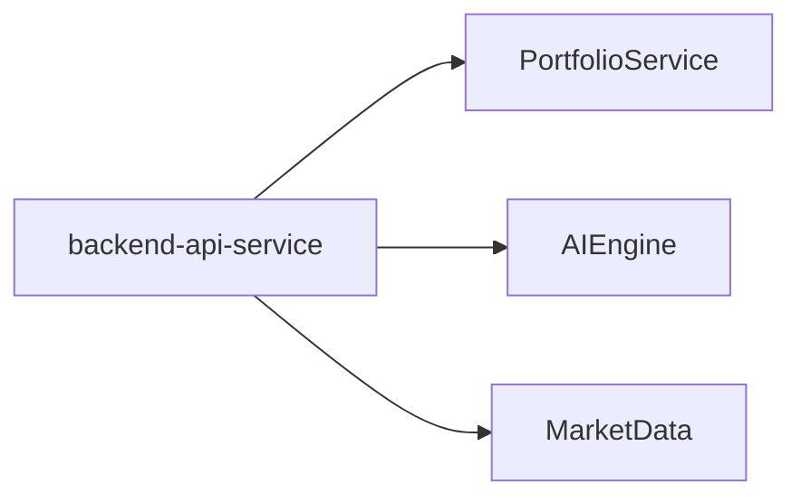
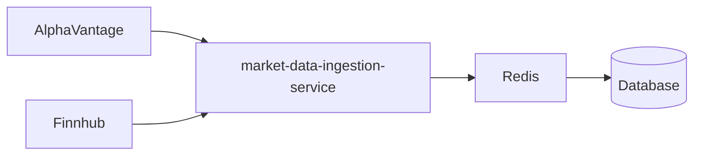
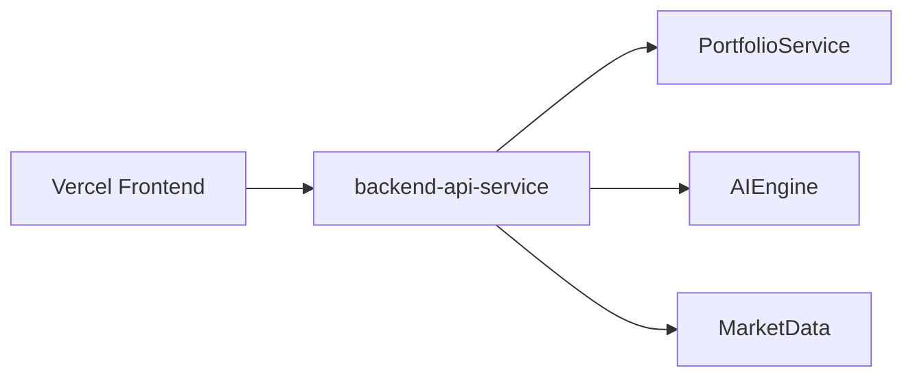
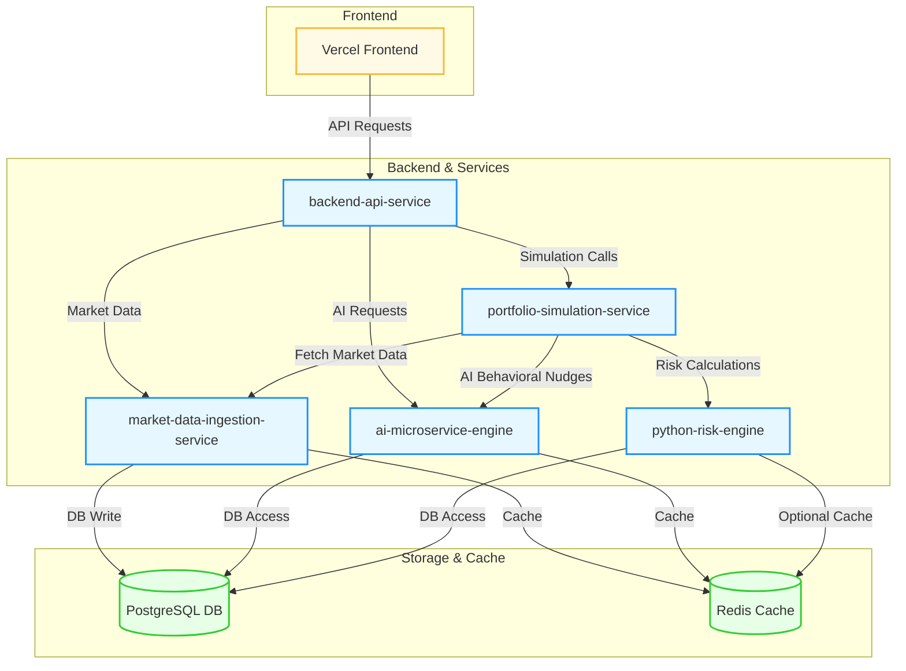

Absolutely! Here’s a **comprehensive README** for your **Beginner Investor Hub backend services**, tailored for containerized deployment with Docker and Render, including development and production instructions, environment configuration, and service overview.

---

# Beginner Investor Hub — Backend Services

This repository contains the backend services for **Beginner Investor Hub**, including:

* `backend-api-service` — API gateway and user-facing endpoints.
* `market-data-ingestion-service` — Fetches and caches market data.
* `ai-microservice-engine` — AI-powered behavioral nudge engine.
* `python-risk-engine` — Risk calculation engine.
* `portfolio-simulation-service` — Simulates portfolios using market data and risk engine.

Frontend is hosted on **Vercel** and communicates with these services via APIs.

---

## Table of Contents

1. [Project Structure](#project-structure)
2. [Dependencies](#dependencies)
3. [Environment Variables](#environment-variables)
4. [Docker Setup](#docker-setup)
5. [Local Development](#local-development)
6. [Production Deployment](#production-deployment)
7. [Service Architecture](#service-architecture)
8. [Security & Best Practices](#security--best-practices)
9. [Healthchecks & Monitoring](#healthchecks--monitoring)

---

## Project Structure

```text
.beginnerinvestorhub/
├── .github/
│   └── workflows/
├── .venv/
├── backups/
├── clean-build/
│   ├── src/
│   │   ├── __tests__/
│   │   ├── config/
│   │   ├── docs/
│   │   └── [+1 files (1 *.ts) & 5 dirs]
│   └── Dockerfile
├── config/
├── docs/
├── frontend/
│   ├── .next/
│   │   ├── cache/
│   │   └── types/
│   ├── .swc/
│   │   └── plugins/
│   ├── __mocks__/
│   └── components/
│       ├── ErrorBoundary/
│       ├── __tests__/
│       ├── affiliate/
│       └── [+23 files (23 *.tsx) & 6 dirs]
├── infrastructure/
│   ├── database/
│   │   └── init-scripts/
│   ├── docker/
│   │   ├── risk-engine-configs/
│   │   ├── docker-compose-dev.yml
│   │   └── docker-compose.yml
│   └── monitoring/
│       ├── alertmanager/
│       ├── grafana/
│       ├── prometheus/
│       └── [+2 files (1 *.yml, 1 *.ts) & 0 dirs]
├── logs/
├── scripts/
├── services/
│   ├── ai-microservice-engine/
│   │   ├── .venv/
│   │   ├── config/
│   │   ├── investor-venv/
│   │   ├── prompts/
│   │   │   ├── README.md
│   │   │   ├── affiliate/
│   │   │   ├── affiliate_injection.json
│   │   │   └── investment/
│   │   └── src/
│   │       ├── main.py
│   │       ├── models/
│   │       └── services/
│   ├── backend-api/
│   │   ├── docs/
│   │   ├── logs/
│   │   ├── prisma/
│   │   └── [+8 files (1 *.dockerignore, 2 *.ts, 3 *.json, 1 *.yaml) & 2 dirs]
│   ├── behavioral-nudge-engine/
│   │   └── src/
│   │       ├── api/
│   │       │   └── v1/
│   │       │       └── endpoints/
│   │       ├── config/
│   │       ├── main.py
│   │       ├── middleware/
│   │       ├── models/
│   │       ├── repositories/
│   │       ├── routes/
│   │       ├── services/
│   │       └── types/
│   ├── marketdata-ingestion/
│   │   ├── .venv/
│   │   └── src/
│   ├── portfolio-simulation/
│   │   └── src/
│   │       ├── app/
│   │       │   ├── algorithms/
│   │       │   ├── api/
│   │       │   ├── core/
│   │       │   ├── models/
│   │       │   └── services/
│   │       ├── tests/
│   │       └── utils/
│   └── python-risk-engine/
│       └── src/
│           ├── algorithms/
│           ├── api/
│           ├── config/
│           ├── core/
│           ├── models/
│           ├── repositories/
│           └── services/
├── shared/
│   ├── auth/
│   ├── cache/
│   ├── database/
│   │   ├── migrations/
│   │   └── models/
│   ├── middleware/
│   ├── rate-limit/
│   ├── redis/
│   └── types/
├── temp-build/
│   └── docs/
├── tests/
│   ├── integration/
│   ├── performance/
│   └── security/
└── [+4 files (1 *.dockerignore, 1 *.env, 1 *.env.development, 1 *.env.example) & 0 dirs]
```

* **backend-api-service**: Node.js/TypeScript API, Express, Prisma.
* **market-data-ingestion-service**: Node.js service for external market APIs.
* **ai-microservice-engine**: Node.js service using OpenAI for behavioral nudges.
* **python-risk-engine**: Python service for risk metrics (NumPy, Pandas).
* **portfolio-simulation-service**: Node.js service integrating all engines for simulations.
* **prisma/**: Database schema and migrations.
* **scripts/**: Utilities such as warm-cache, seeding, docs generation.

---

## Dependencies

* **Node.js** >= 20
* **npm** >= 10
* **Python** >= 3.12 (for `python-risk-engine`)
* **PostgreSQL** >= 15 (managed via Render)
* **Redis** (external service for caching)
* **Firebase Admin SDK** for authentication

---

## Environment Variables

**Backend API Service (`backend-api-service`)**:

```text
NODE_ENV=production
PORT=3000
DATABASE_URL=postgres://...
REDIS_URL=redis://...
JWT_SECRET=generated
COOKIE_SECRET=generated
CORS_ORIGIN=https://frontend.vercel.app
```

**Python Risk Engine (`python-risk-engine`)**:

```text
PORT=3001
REDIS_URL=redis://...
DATABASE_URL=postgres://...
RISK_CALCULATION_WORKERS=2
```

**AI Engine (`ai-microservice-engine`)**:

```text
PORT=3003
REDIS_URL=redis://...
DATABASE_URL=postgres://...
OPENAI_API_KEY=your_key
AI_MODEL_VERSION=gpt-4
AI_TEMPERATURE=0.7
AI_MAX_TOKENS=150
BEHAVIORAL_NUDGE_ENABLED=true
```

**Portfolio Simulation (`portfolio-simulation-service`)**:

```text
PORT=3004
REDIS_URL=redis://...
DATABASE_URL=postgres://...
RISK_ENGINE_URL=https://risk-engine.onrender.com
MARKET_DATA_URL=https://market-data.onrender.com
AI_SERVICE_URL=https://ai-nudge-service.onrender.com
```

> **Note**: Frontend environment variables are managed separately on Vercel.

---

## Docker Setup

### Build & Run Individual Services

```bash
# Backend API
docker build -t backend-api-service ./backend-api-service
docker run -p 3000:3000 backend-api-service

# Python Risk Engine
docker build -t python-risk-engine ./python-risk-engine
docker run -p 3001:3001 python-risk-engine
```

### Multi-Service Local Development

`docker-compose.yml` mounts source code and links services:

```bash
docker-compose up --build
```

* `backend-api` → 3000
* `market-data` → 3002
* `ai-engine` → 3003
* `python-risk-engine` → 3001
* `portfolio-simulation` → 3004
* `redis` → 6379 (external for Render)

---

## Local Development

```bash
# Install dependencies for all Node services
cd backend-api-service && npm ci
cd market-data-ingestion-service && npm ci
cd ai-microservice-engine && npm ci
cd portfolio-simulation-service && npm ci

# Run backend API in development mode
npm run dev

# Run tests
npm run test
```

* Use `cross-env` to manage NODE_ENV.
* Use `.env.local` for local secrets.

---

## Production Deployment (Render)

* Each service has a `render.yaml` entry.
* Services are deployed via Docker images.
* Environment variables configured via Render dashboard.
* Auto-deploy enabled for main branches.

---

## Service Architecture

### Data Ingestion Layer



### Processing Engines



### Application Layer



### API Gateway



---

## Security & Best Practices

* **.dockerignore** is used to exclude node_modules, build outputs, logs, secrets.
* **Non-root users** in Dockerfiles for safer containers.
* **Secrets management** via Render environment variables or `.env` (never commit `.env`).
* **CORS** restricted to frontend domain.

---

## Healthchecks & Monitoring

* Each service exposes `/health` for Render health checks.
* Redis, Database, and API services monitored via logs and metrics.

---

## Useful Scripts

| Script                   | Description         |
| ------------------------ | ------------------- |
| `npm run prisma:migrate` | Apply DB migrations |
| `npm run prisma:seed`    | Seed initial data   |
| `npm run warm-cache`     | Preload Redis cache |
| `npm run lint`           | Run ESLint          |
| `npm run format`         | Prettier formatting |
| `npm run test`           | Run Jest tests      |

---

This README provides **all steps for local development, Dockerization, and deployment**.

---


# Beginner Investor Hub — Backend Services

Backend services for **Beginner Investor Hub**, supporting a **Vercel-hosted frontend**.

---

## Project Structure

```text
.
beginnerinvestorhub/
├── .github/
│   └── workflows/
├── .venv/
├── backups/
├── clean-build/
│   ├── src/
│   │   ├── __tests__/
│   │   ├── config/
│   │   ├── docs/
│   │   └── [+1 files (1 *.ts) & 5 dirs]
│   └── Dockerfile
├── config/
├── docs/
├── frontend/
│   ├── .next/
│   │   ├── cache/
│   │   └── types/
│   ├── .swc/
│   │   └── plugins/
│   ├── __mocks__/
│   └── components/
│       ├── ErrorBoundary/
│       ├── __tests__/
│       ├── affiliate/
│       └── [+23 files (23 *.tsx) & 6 dirs]
├── infrastructure/
│   ├── database/
│   │   └── init-scripts/
│   ├── docker/
│   │   ├── risk-engine-configs/
│   │   ├── docker-compose-dev.yml
│   │   └── docker-compose.yml
│   └── monitoring/
│       ├── alertmanager/
│       ├── grafana/
│       ├── prometheus/
│       └── [+2 files (1 *.yml, 1 *.ts) & 0 dirs]
├── logs/
├── scripts/
├── services/
│   ├── ai-microservice-engine/
│   │   ├── .venv/
│   │   ├── config/
│   │   ├── investor-venv/
│   │   ├── prompts/
│   │   │   ├── README.md
│   │   │   ├── affiliate/
│   │   │   ├── affiliate_injection.json
│   │   │   └── investment/
│   │   └── src/
│   │       ├── main.py
│   │       ├── models/
│   │       └── services/
│   ├── backend-api/
│   │   ├── docs/
│   │   ├── logs/
│   │   ├── prisma/
│   │   └── [+8 files (1 *.dockerignore, 2 *.ts, 3 *.json, 1 *.yaml) & 2 dirs]
│   ├── behavioral-nudge-engine/
│   │   └── src/
│   │       ├── api/
│   │       │   └── v1/
│   │       │       └── endpoints/
│   │       ├── config/
│   │       ├── main.py
│   │       ├── middleware/
│   │       ├── models/
│   │       ├── repositories/
│   │       ├── routes/
│   │       ├── services/
│   │       └── types/
│   ├── marketdata-ingestion/
│   │   ├── .venv/
│   │   └── src/
│   ├── portfolio-simulation/
│   │   └── src/
│   │       ├── app/
│   │       │   ├── algorithms/
│   │       │   ├── api/
│   │       │   ├── core/
│   │       │   ├── models/
│   │       │   └── services/
│   │       ├── tests/
│   │       └── utils/
│   └── python-risk-engine/
│       └── src/
│           ├── algorithms/
│           ├── api/
│           ├── config/
│           ├── core/
│           ├── models/
│           ├── repositories/
│           └── services/
├── shared/
│   ├── auth/
│   ├── cache/
│   ├── database/
│   │   ├── migrations/
│   │   └── models/
│   ├── middleware/
│   ├── rate-limit/
│   ├── redis/
│   └── types/
├── temp-build/
│   └── docs/
├── tests/
│   ├── integration/
│   ├── performance/
│   └── security/
└── [+4 files (1 *.dockerignore, 1 *.env, 1 *.env.development, 1 *.env.example) & 0 dirs]
```

* **backend-api**: Node.js/TypeScript API, Express, Prisma
* **market-data-ingestion**: Node.js service for market data
* **ai-microservice-engine**: Node.js AI behavioral nudges
* **python-risk-engine**: Python service (NumPy/Pandas) for risk metrics
* **portfolio-simulation**: Node.js service integrating engines
* **prisma/**: Database schema and migrations
* **scripts/**: Utility scripts (warm-cache, seed, docs)

---

## Dependencies

* Node.js >= 20
* npm >= 10
* Python >= 3.12 (python-risk-engine)
* PostgreSQL >= 15 (Render managed)
* Redis (external, not on Render)
* Firebase Admin SDK for auth
* Vercel-hosted frontend

---

## Environment Variables

**Backend API**

```text
NODE_ENV=production
PORT=3000
DATABASE_URL=postgres://...
REDIS_URL=redis://...
JWT_SECRET=generated
COOKIE_SECRET=generated
CORS_ORIGIN=https://frontend.vercel.app
```

**Python Risk Engine**

```text
PORT=3001
REDIS_URL=redis://...
DATABASE_URL=postgres://...
RISK_CALCULATION_WORKERS=2
```

**AI Engine**

```text
PORT=3003
REDIS_URL=redis://...
DATABASE_URL=postgres://...
OPENAI_API_KEY=your_key
AI_MODEL_VERSION=gpt-4
AI_TEMPERATURE=0.7
AI_MAX_TOKENS=150
BEHAVIORAL_NUDGE_ENABLED=true
```

**Portfolio Simulation**

```text
PORT=3004
REDIS_URL=redis://...
DATABASE_URL=postgres://...
RISK_ENGINE_URL=https://risk-engine.onrender.com
MARKET_DATA_URL=https://market-data.onrender.com
AI_SERVICE_URL=https://ai-nudge-service.onrender.com
```

---

## Service Architecture

### 1. Data Ingestion Layer



### 2. Processing Engines


### 3. Application Layer


### 4. API Gateway



> **Note:** Frontend communicates with `backend-api-service` only; it’s not containerized.

---

## Docker Setup

### Individual Services

```bash
docker build -t backend-api-service ./backend-api-service
docker run -p 3000:3000 backend-api-service
```

```bash
docker build -t python-risk-engine ./python-risk-engine
docker run -p 3001:3001 python-risk-engine
```

### Local Multi-Service Development

```bash
docker-compose up --build
```

* Ports:

  * backend-api: 3000
  * market-data: 3002
  * ai-engine: 3003
  * python-risk-engine: 3001
  * portfolio-simulation: 3004

---

## Deployment on Render

* Each service is configured via `render.yaml`
* Docker images are used for backend services
* Environment variables are set via Render dashboard
* Auto-deploy enabled for main branches

---

## Security & Best Practices

* Non-root users in Dockerfiles
* `.dockerignore` for node_modules, build outputs, logs, secrets
* Environment secrets handled outside of code repository
* CORS restricted to frontend domain

---

## Healthchecks & Monitoring

* Each service exposes `/health` for monitoring
* Logs and metrics tracked via Render or custom monitoring

---

## Scripts

| Script                   | Description         |
| ------------------------ | ------------------- |
| `npm run prisma:migrate` | Apply DB migrations |
| `npm run prisma:seed`    | Seed initial data   |
| `npm run warm-cache`     | Preload Redis cache |
| `npm run lint`           | Run ESLint          |
| `npm run format`         | Prettier formatting |
| `npm run test`           | Run Jest tests      |

---

 **full-stack architecture diagram**



### Explanation of the Design:

1. **Frontend (Vercel)**

   * Hosted separately, communicates **only via `backend-api-service`**
   * Handles authentication (via Firebase) and UI

2. **Backend Services (Containerized)**

   * Each service has its own Docker image for deployment
   * **backend-api-service** acts as the API gateway
   * **portfolio-simulation-service** aggregates data from AI and Risk engines
   * **market-data-ingestion-service** populates Redis and PostgreSQL
   * **ai-microservice-engine** handles AI calculations and behavioral nudges
   * **python-risk-engine** calculates risk metrics using Python

3. **Storage & Cache**

   * **Redis** for caching frequently used data
   * **PostgreSQL** for persistent storage

4. **Service Communication**

   * All inter-service calls are internal (no direct frontend access)
   * Healthchecks are exposed on `/health` per service

5. **Deployment Strategy**

   * Backend services containerized for Render deployment
   * Frontend deployed on **Vercel**
   * Redis hosted externally (not on Render)

---

