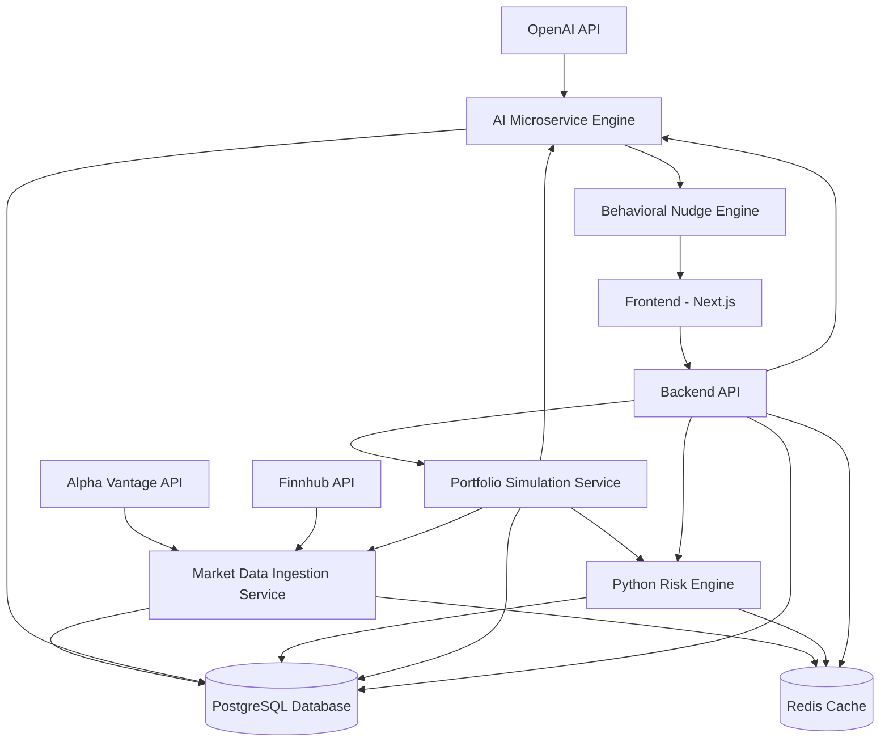

# Beginner Investor Hub

[](https://github.com/Beginnerinvestorhub/beginner-investor-api/actions)
[](https://opensource.org/licenses/ISC)
[](https://nodejs.org/)
[](https://python.org/)

## Project Overview and Goals

Beginner Investor Hub is a comprehensive platform designed to empower novice investors with intelligent tools for financial decision-making. Our backend services provide real-time market data ingestion, AI-powered behavioral nudges, risk assessment, portfolio simulation, and a robust API for seamless integration.

### Key Features
- **Market Data Ingestion**: Real-time financial data from sources like Alpha Vantage and Finnhub.
- **AI-Powered Nudges**: Personalized investment advice using OpenAI's models.
- **Risk Assessment**: Advanced risk calculation and portfolio analysis.
- **Portfolio Simulation**: Simulate investment strategies and outcomes.
- **Secure Authentication**: JWT-based auth with Firebase integration.
- **Scalable Architecture**: Microservices deployed on Render with Docker for easy scaling.

### Goals
- Make investing accessible and educational for beginners.
- Provide data-driven insights to reduce decision-making bias.
- Ensure security, performance, and reliability in a production environment.

## Architecture Diagram

The following Mermaid diagram illustrates the service relationships and data flow:



## Installation and Setup Instructions

### Prerequisites
- **Node.js**: >=24.3.0 (for backend-api and frontend)
- **Python**: 3.11+ (for AI, Risk Engine, and other Python services)
- **Docker**: For containerized deployment
- **Git**: For cloning the repository
- **PostgreSQL**: For database (or use Docker)
- **Redis**: For caching (or use Docker)

### Per-Service Setup

#### 1. Backend API (Node.js/TypeScript)
```bash
cd services/backend-api
npm install
npm run prisma:generate
npm run prisma:migrate
npm run build
npm run dev  # For development
```

- **Environment Variables**: Copy `.env.example` to `.env` and configure database URLs, JWT secrets, etc.
- **Testing**: `npm run test`

#### 2. AI Microservice Engine (Python/FastAPI)
```bash
cd services/ai-microservice-engine
python -m venv venv
source venv/bin/activate  # On Windows: venv\Scripts\activate
pip install -r requirements.txt
uvicorn app:app --reload
```

- **Environment Variables**: Copy `.env.example` to `.env` and set OpenAI API key, database URL.
- **Testing**: Use `pytest` if tests are available.

#### 3. Python Risk Engine (Python)
```bash
cd services/python-risk-engine
python -m venv venv
source venv/bin/activate
pip install -r requirements.txt
python app.py
```

- **Environment Variables**: Configure database and Redis URLs in `.env`.

#### 4. Market Data Ingestion (Python)
```bash
cd services/marketdata-ingestion
python -m venv venv
source venv/bin/activate
pip install -r requirements.txt
python app.py
```

#### 5. Portfolio Simulation (Python)
```bash
cd services/portfolio-simulation
python -m venv venv
source venv/bin/activate
pip install -r requirements.txt
python app.py
```

#### 6. Frontend (Next.js)
```bash
cd frontend
npm install
npm run dev
```

- **Environment Variables**: Copy `.env.example` to `.env.local` and set API endpoints.

### Global Setup
- **Docker**: Use `make dev` for development or `make prod` for production.
- **Database**: Run `scripts/setup-database.sh` to initialize PostgreSQL.
- **Redis**: Follow `scripts/setup-redis.md` for setup.

## Usage Examples and CLI Commands

### Running Tests
```bash
# Backend API
cd services/backend-api && npm run test

# Risk Engine
cd services/python-risk-engine && python -m pytest

# Global Tests
make test
```

### Building and Deployment
```bash
# Build Docker images
make build

# Run in production
make prod

# Health Check
make health
```

### API Usage Example (Backend API)
```javascript
const axios = require('axios');

const response = await axios.get('http://localhost:3000/api/portfolio', {
  headers: { Authorization: `Bearer ${token}` }
});
console.log(response.data);
```

### AI Service Query
```python
import requests

response = requests.post('http://localhost:3003/nudge', json={
  'user_id': '123',
  'query': 'Should I invest in stocks?'
})
print(response.json())
```

## Testing and Validation Steps

1. **Unit Tests**: Run per service (e.g., `npm run test:unit` in backend-api).
2. **Integration Tests**: Use `npm run test:integration`.
3. **Health Checks**: Execute `make health` or `./scripts/health-check.sh`.
4. **Linting and Formatting**:
   - Node.js: `npm run lint && npm run format`
   - Python: `make lint && make format`
5. **Validation Scripts**: Run `scripts/comprehensive-health-check.sh` for full system validation.

## Deployment Guide

### Local Deployment
- Use Docker Compose: `make dev` for development with hot-reload.
- Access services at their respective ports (e.g., backend-api at 3000).

### Production Deployment (Render)
- Services are configured in `render.yaml` for automated deployment.
- Ensure environment variables are set in Render dashboard.
- Database is managed via Render's PostgreSQL service.
- Auto-deploy on git push to main branch.

### CI/CD
- GitHub Actions for automated testing and building (check `.github/` directory).

## Contributing Guidelines

1. **Fork the Repository**: Create your feature branch from `main`.
2. **Set Up Environment**: Follow installation steps and ensure tests pass.
3. **Code Style**:
   - Node.js: Use ESLint and Prettier.
   - Python: Use Black, isort, flake8, and mypy.
4. **Testing**: Add tests for new features and ensure coverage >80%.
5. **Pull Requests**: Include descriptions, tests, and update documentation.
6. **Issues**: Use GitHub Issues for bugs and feature requests.

## Troubleshooting Tips

- **Port Conflicts**: Ensure no other services are using ports 3000-3004.
- **Environment Variables**: Double-check `.env` files; use `.env.example` as reference.
- **Database Issues**: Run `prisma migrate reset` for backend-api if schema changes.
- **Docker Errors**: Clear volumes with `make clean`.
- **API Key Errors**: Verify OpenAI, Alpha Vantage keys in `.env`.
- **Common Logs**: Check `logs/` directory or use `make logs`.
- **Performance**: Monitor with Grafana/Prometheus in risk-engine.

## License and Credits

This project is licensed under the ISC License - see the [LICENSE](LICENSE) file for details.

### Credits
- Built with ❤️ by the Beginner Investor Hub team.
- Powered by OpenAI, Prisma, FastAPI, Next.js, and many open-source tools.
- Special thanks to contributors and the open-source community.

